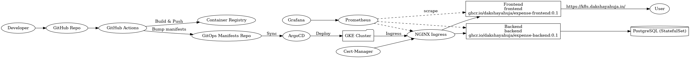
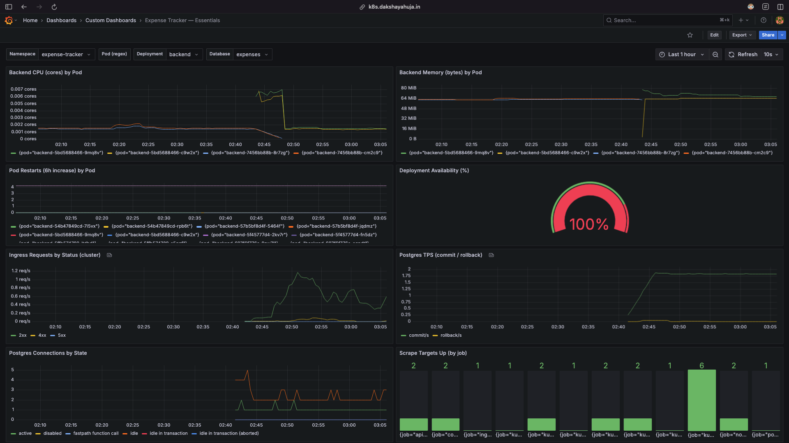

# 🚀 Kubernetes GitOps Delivery Pipeline — Expense Tracker

A **production-capable GitOps-driven Kubernetes infrastructure** featuring a **modern expense tracking application**, CI/CD automation with **GitHub Actions**, **ArgoCD** for GitOps, **Prometheus & Grafana** for observability, and **Cert-Manager** for TLS.


---

## 🎯 Quick Overview

This project demonstrates a **GitOps-based Kubernetes delivery pipeline** deployed on **AWS EKS**, running a **React (Vite) frontend**, **FastAPI backend**, and **PostgreSQL database**.

**Key Features:**
- 🚀 **GitOps Automation** with ArgoCD
- 🔄 **CI/CD Pipeline** via GitHub Actions  
- 📊 **Monitoring & Observability** with Prometheus & Grafana
- 🔐 **Security** with TLS encryption via Cert-Manager
- 📱 **Modern Web App** - Expense Tracker with Google Auth

---

## 🏗 Architecture



*For detailed architecture information, see [ARCHITECTURE.md](docs/ARCHITECTURE.md)*

---

## 🚀 Quick Start

### **Option 1: Deploy to Production (Recommended)**
```bash
# Use the provided scripts for complete deployment
./scripts/bringup.sh
```

### **Option 2: Local Development**
```bash
# Frontend
cd expense-tracker-app/frontend
npm install && npm run dev

# Backend  
cd expense-tracker-app/backend
pip install -r requirements.txt
uvicorn app.main:app --reload
```

---

## 📚 Documentation

- **[🏗️ ARCHITECTURE.md](docs/ARCHITECTURE.md)** - High-level system architecture
- **[🚀 APPLICATION.md](docs/APPLICATION.md)** - Application implementation details
- **[🔧 API.md](docs/API.md)** - Backend API documentation

---

## 🛠 Tech Stack

| Component | Technology |
|-----------|------------|
| **Infrastructure** | Kubernetes (AWS EKS), Terraform |
| **GitOps** | ArgoCD, GitHub Actions |
| **Frontend** | React 18 (Vite), TailwindCSS |
| **Backend** | FastAPI, PostgreSQL |
| **Monitoring** | Prometheus, Grafana |
| **Security** | Cert-Manager, Let's Encrypt |
| **Ingress** | NGINX Ingress Controller |

---

## 🔄 GitOps Workflow

1. **Code Push** → Developer pushes to GitHub
2. **Build & Test** → GitHub Actions builds Docker images
3. **Registry Push** → Images pushed to Container Registry  
4. **Sync** → ArgoCD detects changes & deploys to AWS EKS
5. **Traffic Routing** → NGINX Ingress routes to updated services

*For detailed workflow information, see [ARCHITECTURE.md](docs/ARCHITECTURE.md)*

---

## 🌐 Access Points

- **Application**: `k8s.dakshayahuja.in`
- **ArgoCD**: `k8s.dakshayahuja.in/argocd`
- **Grafana**: `k8s.dakshayahuja.in/grafana`

---

## 📸 Screenshots & Demo

### 🏗️ Infrastructure Dashboard

*GitOps deployment status in ArgoCD - Live sync and deployment management*

### 📱 Application Interface

*Modern expense tracking interface with dark theme - Live demo of core features*

### 📊 Monitoring & Analytics

*Infrastructure monitoring with Prometheus & Grafana*

